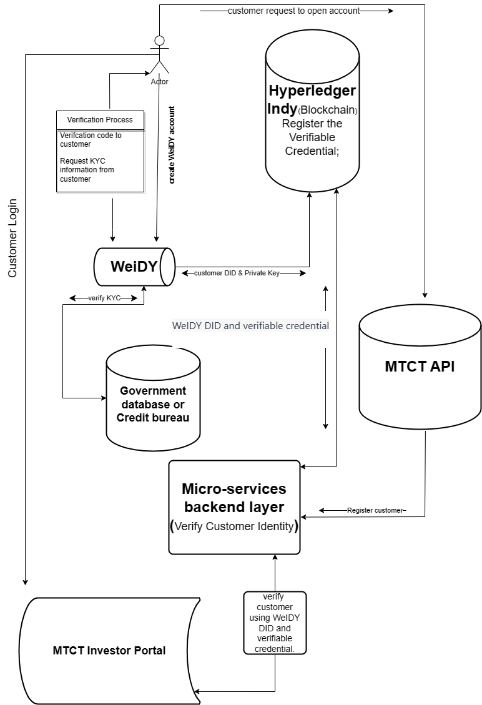

## System Design & Solution Architecture
1. Customer requests to create a WeIDY account.  
2. WeIDY verifies the customer's email and mobile number through SMS and email verification.  
3. WeIDY generates a unique identifier (DID) for the customer and stores it on the blockchain. 
4. WeIDY requests KYC information from the customer and verifies it using a third-party KYC provider. 
5. WeIDY generates a verifiable credential containing the customer's KYC information and stores it on the blockchain. 
6. Customer requests to open an MTCT account. 
7. MTCT API sends a request to the customer onboarding service to register the customer. 
8. Customer onboarding service retrieves the customer's WeIDY DID and verifiable credential from the blockchain. 
9. Customer onboarding service verifies the customer's identity using the verifiable credential and stores the customer's MTCT account details on the blockchain. 
10. Customer can now access the MTCT investor portal and start buying and selling assets. 
11. When a customer places an order, the investor portal service sends a request to the asset management service to execute the transaction. 
12. Asset management service verifies the customer's identity using the verifiable credential and executes the transaction on the blockchain. 
13. Investor portal service updates the customer's portfolio on the blockchain. 
14. When a customer logs in, the authentication service verifies the customer's identity using the verifiable credential. 
15. Customer can access their account details and make transactions through the MTCT investor portal. 
16. When the customer logs out, the authentication service logs them out of all connected services. 
